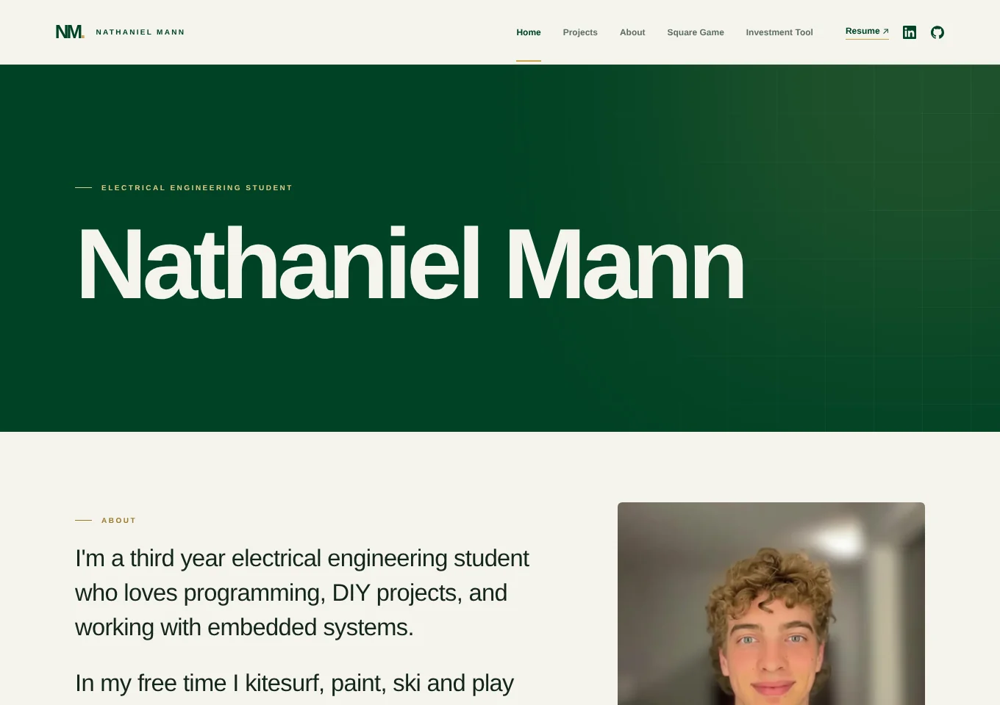

# Homepage

My personal site, live at **[nathanielmann.ca](https://nathanielmann.ca)**. It shows my projects, an about page, my resume and a contact form, and hosts Square Game.



## What's on it

- **Home:** a short introduction, featured projects and a feedback form that emails me.
- **Projects:** each project has a description and a slideshow of photos, and some have videos.
- **About:** more about me, with a photo gallery.
- **Square Game:** the browser side of my online card game. Its code lives in a separate repository.
- Links to my resume, LinkedIn and GitHub, and to [Lettuce](https://app.nathanielmann.ca/app), my investment research tool, which lives in [nmann06/Investment-Tool](https://github.com/nmann06/Investment-Tool).

## Tech stack

| Part | Tech |
| --- | --- |
| Site | Plain HTML, CSS and JavaScript. No framework, no dependencies and no bundler. |
| Hosting | A Render static site, configured in `render.yaml` |
| Contact form | Sent through the Square Game service's `/square-game/api/feedback` endpoint, which emails `nate@nathanielmann.ca` using Resend |
| Local preview | A small Node.js server (`serve.js`) that mirrors Render's routes |

## How it works

- **One page, three views.** `/`, `/about` and `/projects` are all served by `public/index.html`. Render rewrites the paths to it, and `site.js` shows the matching view and sets that page's title, description and canonical URL.
- **Slideshows.** Each project gallery advances on a timer, and pauses on hover, keyboard focus, a playing video or when it scrolls off screen. It respects the reduced-motion setting. Muted autoplay videos (`data-silent`) have no audio track and can't be unmuted.
- **Square Game on a static site.** `sync-game.js` copies the game's browser files into `public/`, adds content hashes to the asset URLs so browsers fetch updates, and adds the homepage's search and link preview tags. The game's API runs on its own Render web service.
- **Search and sharing.** The site has a favicon, link preview images (`og-image.png`), structured data linking my LinkedIn and GitHub, `robots.txt` and `sitemap.xml`.

## Run locally

With Node.js 20 or newer:

```bash
npm start
```

Then open `http://127.0.0.1:8080`. You can also open `public/index.html` directly in a browser, but `/about` and `/projects` only work through the server. There are no automated tests, so check changes in the local preview.

## Adding a project

1. Copy an existing `<article class="project-row">` block in the Projects view of `public/index.html` and update the number, title, subtitle and text.
2. Save images as `.webp` in `public/images/projects/` and videos as `.mp4` in `public/videos/`. Give each image `width`, `height` and `alt` attributes.
3. For a silent video, remove the audio track before adding it, then use `muted autoplay loop playsinline` with `data-silent` and no `controls`, like the existing project videos:

   ```bash
   ffmpeg -i input.mov -an -c:v libx264 -crf 23 -pix_fmt yuv420p -movflags +faststart output.mp4
   ```

4. Update the slide count in the gallery's `aria-label` attributes and its `1 / N` counter.

## Layout

| Path | Purpose |
| --- | --- |
| `public/index.html` | Home, About and Projects views |
| `public/site.css` | Styles |
| `public/site.js` | Chooses the view for `/`, `/about` or `/projects`, sets page metadata, runs the slideshows and sends the feedback form |
| `public/robots.txt`, `public/sitemap.xml` | Crawler rules and the sitemap submitted to Google Search Console. Add new pages to the sitemap. |
| `public/og-image.png`, `public/favicon.*` | Link preview image and site icons |
| `public/square-game.html`, `public/square-game-assets/` | Synced copy of the Square Game browser files |
| `render.yaml` | Render static-site configuration, redirects and rewrites |
| `build.js` | Writes the Square Game API origin into `public/square-game-assets/config.js` during deployment |
| `serve.js` | Local preview server that mirrors the routes in `render.yaml` |
| `sync-game.js` | Copies the Square Game browser files from the game repository |

## Square Game sync

The game's browser files are copied into `public/square-game.html` and `public/square-game-assets/`, so the homepage stays a Render static site. Render rewrites `/square-game`, `/square-game/account` and `/square-game/room/*` to the game page, and redirects common misspellings to `/square-game`. The page calls the separate Square Game Render web service for its API.

`GAME_API_ORIGIN` is set in `render.yaml` to the Square Game web service's public origin. `build.js` writes it into `public/square-game-assets/config.js` during deployment. If the Render static site is configured manually rather than through its Blueprint, set the same variable on its dashboard Environment page before redeploying.

After changing the game UI, run `npm run sync-game` here (or `node sync-game.js /path/to/square-game` if the game repo isn't next to this one). Commit and deploy the resulting homepage changes as well as the game service changes. The script preserves the homepage's API configuration, which `build.js` generates at deployment. Deploying only the game service doesn't update the game UI on nathanielmann.ca. GoDaddy DNS and the homepage's Render static site don't need to change.

## Deploy

The site is a Render **static site** defined in `render.yaml`. Render runs `build.js`, then publishes the `public/` folder. Every push to `main` redeploys it, and pushes to the other repositories don't affect it.

- `nathanielmann.ca` is the custom domain.
- `/app`, `/research.html` and `/login` redirect to `app.nathanielmann.ca`, so links from before the tool moved keep working.
- `/about` and `/projects` are rewritten to `index.html`, and `/portfolio` redirects to `/projects`.

To set it up from scratch, create a new Blueprint in Render from this repository. No secrets are needed. Render shows the DNS record to add for the custom domain.
